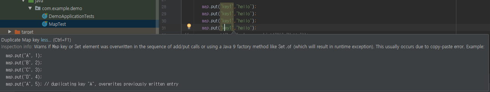

# URI Builer의 query parameter 등록 방법.

1. 개별 등록
    ```java
        builder.queryParam("name","Kim");
    ```
2. List<BasicKeyValuePair>
3. MultivalueMap<String,String>
   
   MultiValueMap을 이용하면 파라미터를 한번에 넣을 수 있다.

    ```java
    import org.springframework.util.LinkedMultiValueMap;
    import org.springframework.util.MultiValueMap;
    
    private MultiValueMap<String,String> mMap = new LinkedMultiValueMap<>();

    mMap.add("key1","hello");
    mMap.add("key1","hello");
    mMap.add("key1","hello");
    mMap.add("key1","hello");
    mMap.add("key2","hi");
    
    builder.quryParams(mMap);

    ```
    MultivalueMap은 동일 key에 value를 넣었을때 value가 list로 들어간다.
    일반 Map은 동일 key에 value를 넣었을때 duplicated key로 해당 키값에 value가 덮어씌워진다. 



# RestTemplate 에서의 등록

```java
restTemplate.patchForObject("uri","body", ExParam.class,new LinkedMultiValueMap<>());
```
restTemplate에 직접 uriVariable을 넣어준다.