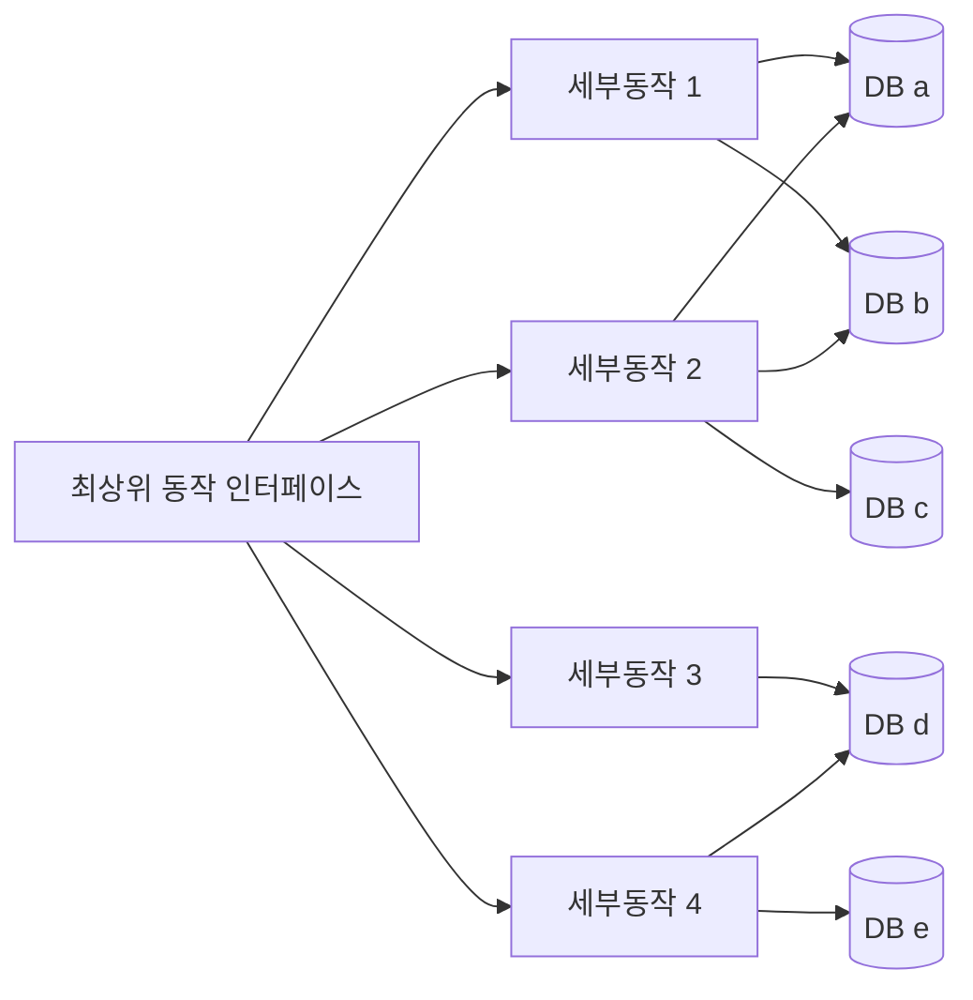
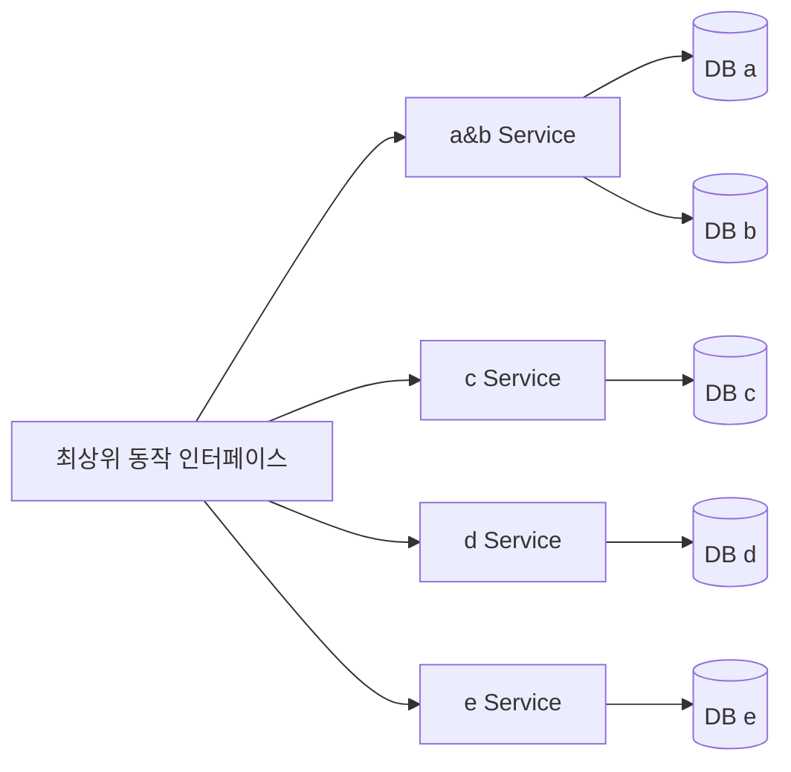

# 상황
- 대분류의 동작 A가 있고
  - 하위동작 A_1, A_2, A_3, A_4 가 있다.
    - 각 동작에서는 a,b,c,d,e 데이터를 복합적으로 다룬다.
# 구조 고민
## 1. 동작으로 묶는다.

### 장단점
- 장점 
  - 세부 동작으로 인해 영향받는 부분을 쉽게 찾아볼 수 있다.
  - 세부 동작의 스펙이 변경되면 변경범위가 작다.
  - 세부 동작을 재활용할 수 있다.
- 단점 
  - 데이터가 어떻게 영향을 받는지 보려면 다 열어봐야한다.
  - 완성된 코드가 자주 바뀌지 않는다는 전제하에,(이상황이 더 많았음) 유지보수를 하면서, 어떤 동작으로 영향받는 부분을 보기보다, 어떤 데이터가 영향을 받는지가 필요한 경우가 더 많았따.?
  - 세부동작이라고 묶기 애매한 경우들도 있다.

## 2. 데이터로 묶기

### 장단점
- 장점 
  - 최상위 동작으로 영향받는 데이터를 확인하기 쉽다.
- 단점
  - 어떤 세부 동작으로 인해 발생하는 영향도를 보려면 다 열어봐야함
  ex) A_1 의 동작으로 어떤 데이터가 영향받는지를 알수 없음.

## 요구사항 분석
- 세부동작은 원자적이지 않다.
  - 세부동작에서도 상위 인터페이스별로 동작이 달라진다. 꼭 담겨야할 공통되는 동작이 없다?
- 빈도수 : 스펙변경 < 데이터 영향 원인 분석

## 결론
- 원자적으로 묶여야하는 세부 동작은, 세부동작으로 묶고
- 최상위 인터페이스마다 달라지는 세부동작은 최상위에서 다룬다?
- 바뀐게없네,,
