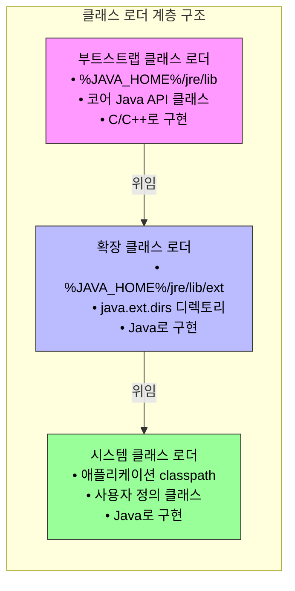

# 7. 클래스 로딩 매커니즘
- 자바 가상머신은 클래스를 설명하는 데이터를 클래스파일로부터 메모리로 읽어들이고, 그 데이터를 검증,변환,초기화하고 나서 최종적으로 가상 머신이 곧바로 사용할수있는 자바 타입을 생성한다.
- 자바 언어는 프로그램 실행중에 클래스로딩, 링킹,ㅇ 초기화 모두 실행하므로, 성능이 살짝 떨어지지만, 이 덕분에 유연성이 있다.
  - ex) 인터페이스로 작성해두면 실제 구현클래스 결정하는것은 런타임에
- 이 장에서의 '클래스파일'은 디스크에있는 파일이 아니라 일련의 바이너리 스트림.

## 2. 클래스 로딩 시점.


- 각 단계의 순서 기준은 단계의 '시작 시점' 이며, 병렬로 진행될 수 있다.
- 해석 단계는 런타임 바인딩을 위해 초기화 이후에 시작할 수 있다.

### 초기화가 즉시 시작되어야하는 상황 = 타입에 대한 능동 참조
1. new, getstatic, putstatic, invokestatic
  - new 키워드로 객체의 인스턴스 생성
  - 타입의 정적 필드를 읽거나 설정
  - 타입의 정적 메서드 호출
2. 리플렉션 메서드를 사용할때
3. 하위 클래스 초기화시 상위 클래스 초기화.
4. main() 메서드를 포함하는 클래스나 인터페이스.
5. MethodHandle 인스턴스를 호출할때
6. 인터페이스에 default method가 정의되어있으면, 구현한 클래스가 초기화할때 인터페이스부터 초기화.

### 초기화를 촉발하지않는 상황 = 수동참조
1. 상위 클래스에 정의된 필드를 하위 클래스를 통해 참조하면 하위클래스는 초기화되지 않는다.
```java
class SuperClass {
  public static int count = 0;
}
class SubClass extends SuperClass {
  ..
}
void main() {
  SubClass.count // SubClass는 초기화 X
}
```

2. 배열 정의에서 클래스를 참조하는경우
```java
SuperClass[] sut = new SuperClass[10];
```
: 배열 초기화시에는 바이트코드레벨에서 다른 클래스의 초기화단계를 촉발한다. `Lpackage1.package2.SuperClass`

3. 클래스 상수를 참조할때
```java
class ConstClass {
    public static final String TEMP = "TEMP"
}
void main(){
  ConstClass.TEMP
}
```
: 컴파일과정에서 클래스 자체의 상수풀을 참조하도록 변경되어, 컴파일 후에는 두 클래스 파일을 잇는 연결점이 없다.

4. 인터페이스 초기화 시에는 상위 인터페이스 초기화가 필요없다. (클래스와 다른점)

## 3. 클래스 로딩 처리 과정
### 1. 로딩
1. 로딩 단계가 끝나면 binary byte stream -> 메서드 영역 에 저장된다.
2. java.lang.Class 객체를 자바 힙에 초기화 한다.
- 배열 외 타입로딩은 개발자가 제어할수있는 가장 쉬운단계
- 배열클래스는 클래스로더가 생성하지않고, JVM이 직접 메모리에 동적으로 생성한다.
  - 배열의 원소타입은 클래스로더를 통해 로드된다.
  - 배열클래스의 접근성은 해당 컴포넌트 타입과 같다.
    - int[][] => 원소타입 : int / 컴포넌트타입 : int[]

### 2. 검증
- 목적
  - 클래스파일의 byte stream 이 JVM 명세를 따르는지.
  - 실행시 JVM 보안을 위협하지 않는지 검증.
    - 클래스파일은 직접 바이너리편집기로 생성할수도 있기때문에, 악의적 코드삽입이 가능.
- 프로덕션 환경에서 실행할때는 모든 코드 신뢰가 가능하다면 검증을 건너뛰기도 한다. (-Xverify:none)

### 2.1. 파일 형식 검증
- 바이트스트림이 클래스 파일 형식에 부합하고 현재버전의 가상머신에서 처리될수있는지 검증.
- 검증을 통과하면 바이트스트림이 JVM 메서드영역에 저장된다.
> 로딩단계에서 올린다면서??
- 검증 예
  - 매직넘버인 0xCAFEBABE로 시작하는지
  - 지원하지않는 타입의 상수가 상수풀에 들어가있지는 않는지

### 2.2. 메타데이터 검증
- 클래스 메타데이터 정보에 대한 의미론적인 검증. JVM 요구사항을 만족하는지 확인.
- 검증 예
  - 상위클래스가 있는지 (java.lang.Object 제외)
  - 필드와 메서드가 상위클래스와 충돌하는지
  - 클래스가 인터페이스를 모두 구현하는지

### 2.3. 바이트 코드 검증
- 데이터 흐름과 제어 흐름을 분석하여 프로그램의 의미가 적법하고 논리적인지 확인하는것.
- 메서드 본문 Code 속성을 분석한다.
- 검증 예
  - jump 명령어가 메서드 본문 바깥의 바이트코드 명령어로 점프하지 않아야한다.
  - 메서드 본문에서 형변환이 항상 유효한지
   > 런타임에서만 확인할수있는 형변환 케이스가 있었음. 기억해보기
- 이 과정은 너무 길어질수있으므로, 가능한 검증은 javac 컴파일러에서 수행한다. (Code 속성테이블에 StackMapTable 6.3.7절)

### 2.4. 심벌 참조 검증
- 심벌참조를 직접참조로 변환할때 수행된다. (링킹중 해석단계에서 일어남.)
> 검증단계는 병렬로 수행되어야만 하는듯? 
- 현재 클래스가 참조하는 특정 외부 클래스, 메서드, 필드, 그외 자원들에 접근할 권한이 있는지 본다.


### 3. 준비
- 클래스변수(정적 변수)를 메모리에 할당하고 초깃값을 설정하는 단계. (인스턴스변수가 아님)
  - JDK8~ 클래스 변수가 클래스 객체와 함께 자바힙에 저장된다.
- static : 초깃값은 해당 데이터타입의 제로값. 실제 값할당은 '클래스 초기화 단계' 에서 발생.
- static final : `ConstantValue` 속성이 존재한다면 상수로 초기화.

### 4. 해석
- 상수풀의 심벌참조를 직접참조로 대체하는 과정.
- 심벌참조 : 대상을 명확하게 지칭할 수 있는 모든 형태의 리터럴, (클래스이름, 변수이름 등)
  - ex) CONSTANT_Class_info, CONSTANT_Fieldref_info ,,,
- 직접참조 : 대상의 위치를 간접적으로 가리키는 핸들. 포인터, 오프셋 등,, 메모리 레이아웃과 밀접하게 관련.
  - 직접참조는 참조 대상이 가상머신의 메모리에 이미 존재해야한다.
- 메서드나 필드에 접근할수있는지 접근자 확인도 진행한다.
- 일반적으로 항상 같은 결과를 내야하므로, 첫번째 해석 결과를 캐싱한다. (실패 -> 실패)
- invokedynamic 명령어는 재해석이 가능하다. (실패 -> 성공)


```java
class F implements G {

}

class E {
  public static F[] F_ARRAY = new F[10]{};
  public static void use(){}
}

class D extends C{
  void {
    E.F_ARRAY
    E.use()
  }
}
```
`D`가 해석되는 상황 가정.
- 재귀적으로 로딩하므로, 전체 로딩순서는 
  1. C
  2. G (E.F_ARRAY 로딩시)
  3. F (E.F_ARRAY 로딩시)
  4. E (E.F_ARRAY 로딩시)
  5. D
#### 클래스 또는 인터페이스 해석
- `D 해석` : CONSTANT_Class_info => C
1. '로딩'단계에서 C -> D 순서로 로딩됨.
2. '해석'단계에서 심벌참조가 직접참조로 메모리위치를 가르키게됨.
  - 접근권한을 확인.

#### 필드 해석
- `E.F_Array 해석 ` : CONSTANT_Field_info => F_Array
1. E 로딩이 먼저.
2. Lpackage.F 배열 클래스 로딩
3. F 로딩 (아래 인터페이스 해석 참고)
4. E.F_Array 직접 참조

#### 메서드 해석
- `E.use()` : CONSTANT_Method_info
1. E 로딩 먼저.
2. E.use 메서드 직접 참조.

#### 인터페이스 해석
- F 로딩시 
1. G 인터페이스 로딩
2. F 로딩

### 5.초기화
- 클래스 생성자인 `<cinit>()` 메서드를 실행하는 단계. 
  - 자바언어에서의 생성자는 `<init>()` 이다.
- 컴파일러가 수집하는 순서는 문장이 소스파일에 등장하는 순서에 영향을받는다.
- 클래스는 부모의 cinit이 먼저 실행된다.
```java
static class Parent {
  public static int A = 1;    // 실행순서1
  {
    static A = 2              // 실행순서2
  }
}
static class Sub extends Paren {
  public static int B = A;    // 실행순서3
}

Sub.B == 2
```
- 인터페이스는 부모 cinit이 먼저 실행될 필요가 없다. 부모인터페이스가 사용되는 시점에 초기화된다.
- 여러스레드가 동시에 초기화할때, 한 스레드만 수행하고 나머지 스레드는 block되므로, 적절히 동기화되도록 해야한다. 
  - static 구문이 장시간 여러스레드 블록을 유도할수있다.

## 4. 클래스 로더
### 1. 클래스와 클래스 로드
- 각 클래스 로더는 독립적인 클래스 이름공간을 지님.
  - 두 클래스가 '동치인가' 여부는 같은 클래스로더로 로드했을때에만 의미가 있다.
  - 동일 클래스, 다른 클래스로더가 로드했을때 instanceof 해보면 false로 나옴.

### 2. 부모 위임 모델

- 시스템 클래스로더가 기본 클래스로더.
- 모든 로드 요청은 우선 최상위인 부트스트랩 클래스 로더로 넘겨진다.
- 프로그램이 아무리 많은 클래스로더를 활용하더라도 동일 클래스에 대한 동치관계를 보장한다.

### 3. 부모 위임 모델에 대한 도전
1. 부모위임모델이 1.2에서 추가되기 이전 커스텀 클래스로더도 호환되게끔 loadClass 메서드를 상속불가로만듦.
2. 부모 클래스로더가 사용자 코드를 다시 호출해야하는경우 -> 스레드별 콘텍스트 클래스 로더 도입으로 해결.
3. 동적인 구성요소 교체 (핫스왑, 모듈 핫배포) 지원
  - OSGI : 모듈 핫배포에서 모듈(번들) 각각이 자체 클래스 로더를 지니며, java.*, 위임목록에 있는 클래스는 부모클래스로더에서 , 그외는 번들 클래스로더에서 로드한다.

## 5. 자바 모듈 시스템
- ~JDK8 필요한 타입이 classpath에 없어도 실행되며, RuntimeException이 발생됨.
- JDK9~ 필요한 의존성이 갖춰졌는지 개발단계에서 확인가능.

### 1. 모듈 호환성

### 2. 
