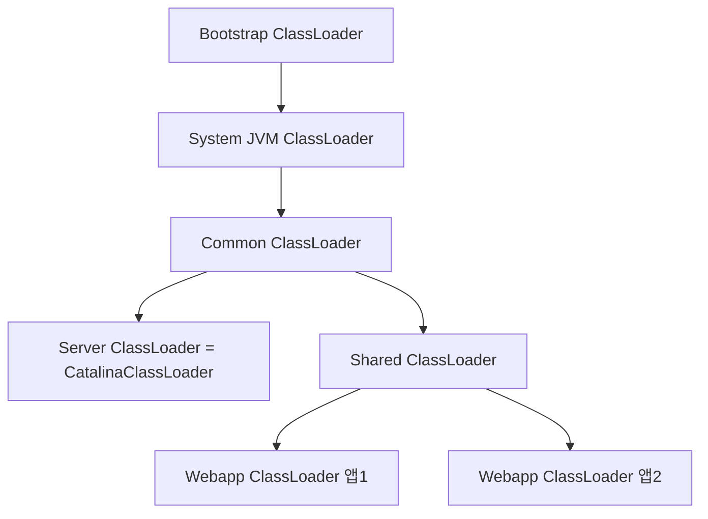
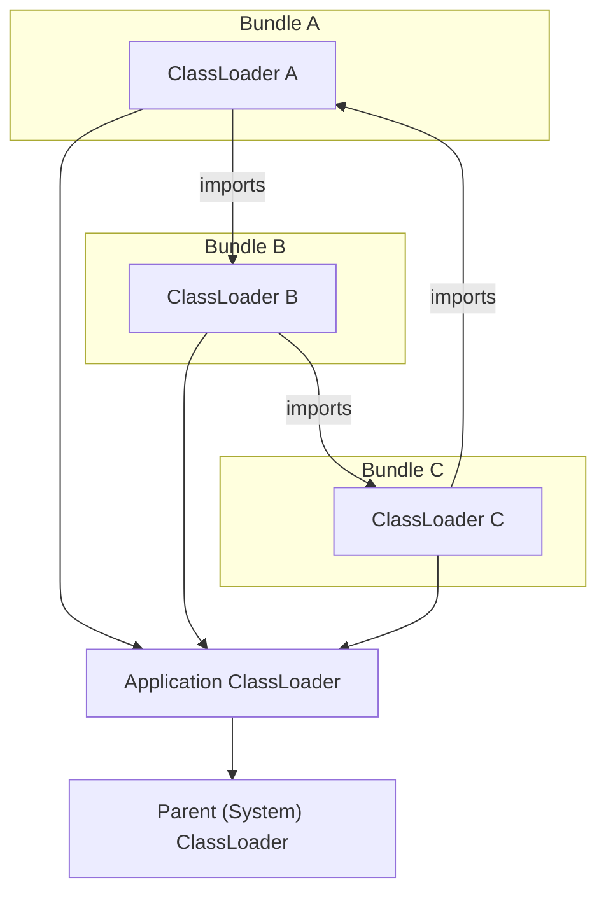

# 09. 클래스 로딩과 실행 서브시스템, 사례와 실전
## 1. 톰캣 : 정통 클래스 로더 아키텍처
- 자바 웹서버(톰캣, 제티, 웹로직,,) 은 모두 자체 정의한 클래스 로더를 사용한다.
  1. 서버는 개별 애플리케이션이 클래스 라이브러리를 독립적으로 사용할 수 있도록 보장해야한다. (각 애플리케이션이 각자의 라이브러리를 사용)
  2. 반대로 똑같은 서버에 배포된 둘 이상의 웹 애플리케이션이 사용하는 자바 클래스 라이브러리는 서로 공유될수도 있다. (공유되지않는다면, VM의 메서드 영역이 과도하게 확장될 위험)
  3. 보안상의 이유로 서버가 사용하는 클래스 라이브러리는 애플리케이션의 클래스 라이브러리와 독립적이어야한다.
  4. JSP는 핫스왑이 지원되어야하는데, 클래스로더를 바꿔치는방식으로 구현된다.
- 다양한 웹서버에서 서드파티 클래스 라이브러리 저장용으로 별도의 classpath를 제공하기도 한다.
  - lib
  - classes
### Tomcat 5 까지의 ClassLoader 구조

| 디렉토리 경로                          | 설명                                | 라이브러리 적용 범위                  | 클래스 로더          |
|---------------------------------------|-----------------------------------|------------------------------------|--------------------|
| CATALINA_HOME/common/classes          | 공통 클래스 디렉토리                 | 톰캣 및 모든 웹앱에서 공유             | Common ClassLoader |
| CATALINA_HOME/common/lib              | 공통 라이브러리 (JAR) 디렉토리        | 톰캣 및 모든 웹앱에서 공유             | Common ClassLoader |
| CATALINA_HOME/server/classes          | 서버 전용 클래스 디렉토리             | 톰캣 서버 내부에서만 사용              | Server ClassLoader |
| CATALINA_HOME/server/lib              | 서버 전용 라이브러리 디렉토리          | 톰캣 서버 내부에서만 사용              | Server ClassLoader |
| CATALINA_HOME/shared/classes          | 공유 클래스 디렉토리 (웹앱 간 공유용)   | 모든 웹앱에서 공유, 톰캣 서버에서는 사용하지 않음 | Shared ClassLoader |
| CATALINA_BASE/webapps/앱명/WEB-INF/classes | 애플리케이션 클래스 디렉토리          | 해당 웹앱에서만 사용 가능              | Webapp ClassLoader |
| CATALINA_BASE/webapps/앱명/WEB-INF/lib     | 애플리케이션 라이브러리 디렉토리 (JAR) | 해당 웹앱에서만 사용 가능              | Webapp ClassLoader |hared ClassLoader |
CATALINA_BASE/webapps/앱명/WEB-INF/lib | 애플리케이션 라이브러리 디렉토리 (JAR) | 해당 웹앱에서만 사용 가능 | Webapp ClassLoader




| 클래스 로더          | 주 역할                              | 사용 주체               |
|----------------------|-------------------------------------|------------------------|
| Common ClassLoader   | 모든 웹앱 + 톰캣 공용 라이브러리 로딩 | 톰캣, 모든 웹앱         |
| Server ClassLoader   | 톰캣 서버 내부 코드 전용              | 톰캣 전용              |
| Shared ClassLoader   | 모든 웹앱에서 공유되는 클래스/라이브러리 | 웹 애플리케이션         |
| Webapp ClassLoader   | 개별 웹앱 전용, 클래스 격리           | 해당 웹 애플리케이션 전용 |

### Tomcat 6 부터

| 디렉토리 경로 | 설명 | 라이브러리 적용 범위 | 클래스 로더 |
|--------------|------|-------------------|------------|
| CATALINA_HOME/bin/ | 실행 스크립트 및 부트스트랩 클래스 (startup.sh, catalina.bat) | 톰캣 실행용 내부 코드 | Bootstrap ClassLoader |
| CATALINA_HOME/lib/ | 공통 라이브러리 JAR 위치 (예: servlet-api.jar, tomcat-util.jar) | 톰캣 전체 및 모든 웹앱에서 공유 | Common ClassLoader |
| CATALINA_HOME/conf/ | 설정 파일 저장소 (server.xml, web.xml, context.xml 등) | - | - |
| CATALINA_BASE/webapps/앱명/WEB-INF/classes/ | 개별 웹앱의 클래스 파일 위치 | 해당 웹앱 전용 | Webapp ClassLoader |
| CATALINA_BASE/webapps/앱명/WEB-INF/lib/ | 개별 웹앱의 JAR 라이브러리 위치 | 해당 웹앱 전용 | Webapp ClassLoader |
| CATALINA_BASE/work/ | JSP 등 컴파일 결과 저장 | - | - |
| CATALINA_BASE/logs/ | 톰캣 로그 저장 디렉토리 | - | - |
| CATALINA_BASE/temp/ | 임시 파일 저장소 (톰캣 내부에서 사용) | - | - |

### 질문
> 여러 웹 애플리케이션이 있다면, 스프링은 common이나 shared에 올라가고, 웹 애플리케이션은 webapps/WEB-INF/ 에 올라갈것. 스프링에서 사용자 프로그램클래스에 어떻게 접근하는가?

- 7장 : 부모 클래스로더가 사용자 코드를 다시 호출해야하는경우 -> 스레드별 콘텍스트 클래스 로더 도입으로 해결.

## 2. OSGi : 유연한 클래스 로더 아키텍처
- OSGi : 자바기반 동적 모듈 명세.
  - 주된 도입 이유는 OSGi 아키텍처 기반으로 개발하면 모듈 수준에서 핫스왑을 구현하기 쉽기때문.
- OSGi는 전통적인 부모위임모델을 따르지 않음.

- 의존목록에 있는 클래스의 로딩은 해당 클래스에 의존하는 번들의 클래스 로더에 위임한다.
  - BundleA의 package'a' 가 package 'c'가 필요하다면, BundleC 클래스로더가 로드하도록 위임한다.
- 클래스로더가 병렬로 동작하면, 교착상태에 빠질 가능성이 높다 -> 단일스레드 로딩으로 해결.
- 가상머신 하나에서 구동되는 애플리케이션이라면, 초기부터 OSGi를 기반으로 개발하는 방법도 좋은 선택. 의존성 통제가 필요하지만, 그만큼 위험하기도함.

## 3. 바이트 코드 생성 기술과 동적 프락시 구현
- 바이트 코드를 생성하는 예
  - JSP 컴파일러
  - 컴파일 타임에 코드를 변경해주는 AOP 프레임워크
  - 동적 프락시 기술 `java.lang.reflect.InvokeHandler` `ProxyGenerator`
    - '동적' 은 자바코드를 사용해 프락시 클래스의 '정적' 프락시를 작성하는일.
  - reflection 최적화

- 동적 프락시 예
```java
interface IHello {
  void sayHello();
}
class Hello implements IHello{
  void sayHello(){
    println("hello world")
  }
}
class DynamicProxy implements InvocationHandler{
  Object bind(Object obj){
    return Proxy.newProxyInstance(obj.class.getClassLoader(),obj.class.getInterface(),this)
  }
  @Override
  Object invoke(Object proxy,Method method ,Object[] args) throws Throwable{
    println("welcome")
    return method.invoke(originalObj,args)
  }
}
main() {
  IHello hello = (Ihello) new DynamicProxy().bind(new Hello())
  hello.sayHello()  //Welcome, hello world
}
```
- DynamicProxy가 IHello를 Implements 하는 `$Proxy0.class` 를 만들어낸다.
  
### 4. 백포트 도구 : 자바의 타임머신
