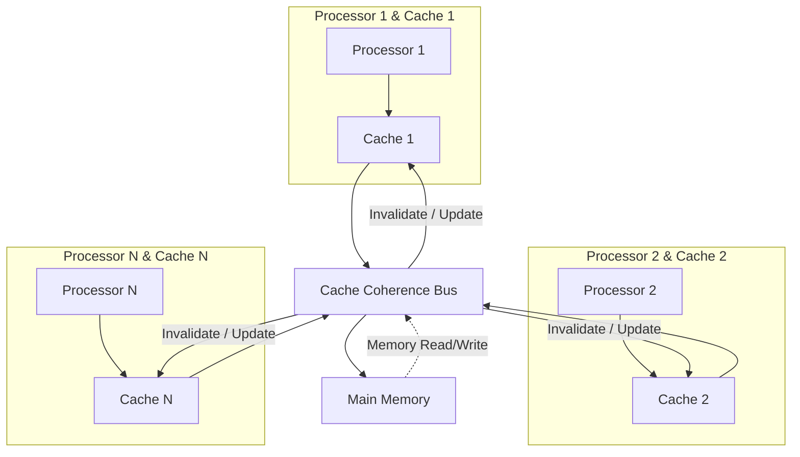

 
# 12. 자바 메모리 모델과 스레드
## 하드웨어에서의 효율과 일관성


- 공유 메모리 멀티프로세서 시스템 : 프로세서 각각이 자신만의 캐시를 갖춘 채 똑같은 메인 메모리를 공유한다.
- 각 프로세서의 캐시 <-> 메인메모리 간의 일관성 문제를 해결하려면 프로세서가 캐시를 이용할때 정해진 프로토콜을 따라야한다.

## 12.3 자바 메모리 모델
- 자바 프로그램은 플랫폼에 상관없이 메모리를 일관된 방식으로 이용할수있다. (인터페이스)

### 12.3.1 메인 메모리와 작업 메모리 
자바 메모리 모델에서
- 메인 메모리 : 가상머신이 관리하는 메모리
- 작업 메모리 : 각 스레드가 관리하는 자체 메모리
  - 해당 스레드가 사용하는 변수가 저장된 메인 메모리의 복사본이 담겨있다.
  - 스레드가 변수를 읽고쓰는 모든 연산은 작업 메모리에서 수행되며, 메인 메모리의 데이터는 직접 읽고 쓸 수 없다.
- 위 공유메모리 멀티프로세서 시스템과 비교했을때, 메인메모리는 하드웨어 메모리에 대응하며, 작업 메모리는 레지스터와 캐시에 대응한다.

### 12.3.2 메모리간 상호작용
- 각 단계의 연산이 원자적으로 이루어지도록 보장되어야한다.
- 각 연산은 순서대로 실행되어야할뿐, 바로 이어서 실행될필요는 없다.
- 연산
  - lock
  - unlock
  - read : 적재연산을 위해 메인메모리의 변수값을 특정 스레드의 작업메모리로 전송
  - load : read로 얻어온 값을 작업메모리의 변수에 복사
  - use : 작업메모리의 변수값을 실행엔진으로 전달, 변수값사용 바이트코드마다 실행된다.
  - assign : 실행엔진에서 받은 값을 작업 메모리의 변수에 할당.
  - store : 작업메모리의 변수값을 메인메모리로 전송
  - write : 메인메모리의 변수에 기록 
- 변수는 메인메모리에서만 새로 생겨날수있다. (=변수를 사용하거나 저장하기전에 할당과 적재가 이루어져야한다.)

### 12.3.3 volatile 변수용 특별 규칙
- volatile은 다른 동기화 도구들보다 코드를 더 빠르게 실행하여 다른 lock 방식보다 성능이 좋다.
- 
#### volatile 변수의 특성1 가시성 : 모든 스레드에서 이 변수를 투명하게 볼 수 있다.
  - 한 스레드가 값을 수정하면, 다른 스레드도 새로운 값을 즉시 알게된다.

##### volatile 변수가 동시성환경에서 안전하지만은 않다.
```java
static volatile int race = 0;

static void increase(){race++}

// 20개의 스레드에서
new Thread(() -> for(0...1000){increase()})
race ??   // 기대결과 20*1000 = 20,000
```
- increase 메서드의 바이트코드
  - 실제로는 바이트코드만으로 동시성문제를 분석하기어려움 : 바이느코드를 해석한 인터프린터가 여러 기계어를 실행하기도하기때문.
```
getstatic   // 최신의 race값을 가져옴.
iconst_1    // 이 아래부터는 race값이 변경되는것을 인지하지못함.
iadd
putstatic
return
```

##### volatile 변수의 적절한 사용법
```java
public volatile boolean isShutDownRequested;
public void doWork(){
  while(!isShutDownRequested) {...}
}
// A thread 
// doSomething...
isShutDownRequeste=true
/// B thread
doWork()  // isShutDownRequested 변수 변경에의해 중단됨.
```

#### volatile 변수의 특성2 명령어 재정렬 최적화를 막아준다.
- 위 코드에서 volatile이 아니면 A thread에서 doSomething이 끝나기전에 IsShutDownRequested 의 실행이 당겨져서 B thread가 의도치않게 종료될수있다.
- volatile 변수 저장시 바이트코드레벨에서 `lock addl $0x0` 이 추가되는데 메모리 장벽이라고 불린다. 
  - 프로세서의 캐시를 메인메모리에 쓰고, 다른 프로세서의 캐시를 무효화한다.
  - 이 명령어가 수정사항을 메모리에 동기화할때는 이전의 모든 작업이 수행되었음을 뜻하므로, 명령어 재정렬이 메모리장벽을 넘을 수 없는 효과를 가져온다.

### 12.3.4 long과 double 변수용 특별 규칙