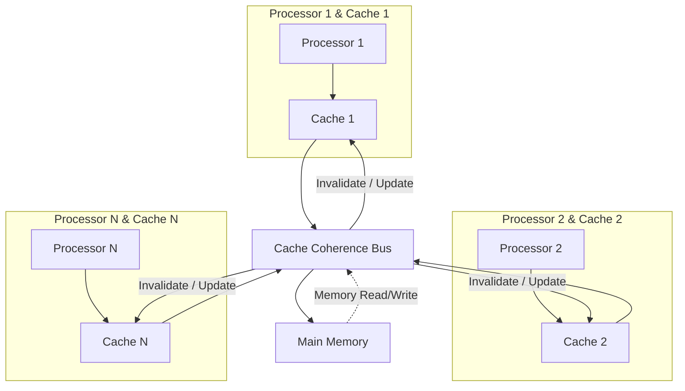
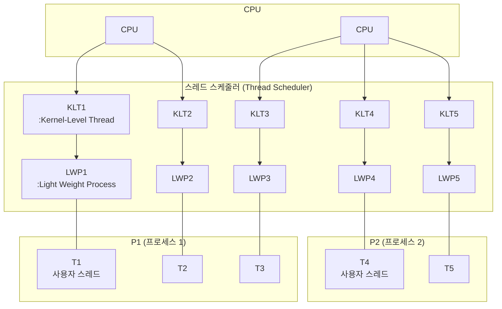
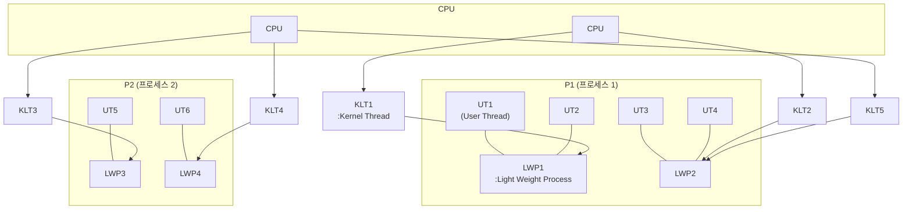

 
# 12. 자바 메모리 모델과 스레드
## 하드웨어에서의 효율과 일관성


- 공유 메모리 멀티프로세서 시스템 : 프로세서 각각이 자신만의 캐시를 갖춘 채 똑같은 메인 메모리를 공유한다.
- 각 프로세서의 캐시 <-> 메인메모리 간의 일관성 문제를 해결하려면 프로세서가 캐시를 이용할때 정해진 프로토콜을 따라야한다.

## 12.3 자바 메모리 모델
- 자바 프로그램은 플랫폼에 상관없이 메모리를 일관된 방식으로 이용할수있다. (인터페이스)

### 12.3.1 메인 메모리와 작업 메모리 
자바 메모리 모델에서
- 메인 메모리 : 가상머신이 관리하는 메모리
- 작업 메모리 : 각 스레드가 관리하는 자체 메모리
  - 해당 스레드가 사용하는 변수가 저장된 메인 메모리의 복사본이 담겨있다.
  - 스레드가 변수를 읽고쓰는 모든 연산은 작업 메모리에서 수행되며, 메인 메모리의 데이터는 직접 읽고 쓸 수 없다.
- 위 공유메모리 멀티프로세서 시스템과 비교했을때, 메인메모리는 하드웨어 메모리에 대응하며, 작업 메모리는 레지스터와 캐시에 대응한다.

### 12.3.2 메모리간 상호작용
- 각 단계의 연산이 원자적으로 이루어지도록 보장되어야한다.
- 각 연산은 순서대로 실행되어야할뿐, 바로 이어서 실행될필요는 없다.
- 연산
  - lock
  - unlock
  - read : 적재연산을 위해 메인메모리의 변수값을 특정 스레드의 작업메모리로 전송
  - load : read로 얻어온 값을 작업메모리의 변수에 복사
  - use : 작업메모리의 변수값을 실행엔진으로 전달, 변수값사용 바이트코드마다 실행된다.
  - assign : 실행엔진에서 받은 값을 작업 메모리의 변수에 할당.
  - store : 작업메모리의 변수값을 메인메모리로 전송
  - write : 메인메모리의 변수에 기록 
- 변수는 메인메모리에서만 새로 생겨날수있다. (=변수를 사용하거나 저장하기전에 할당과 적재가 이루어져야한다.)

### 12.3.3 volatile 변수용 특별 규칙
- volatile은 다른 동기화 도구들보다 코드를 더 빠르게 실행하여 다른 lock 방식보다 성능이 좋다.
- 
#### volatile 변수의 특성1 가시성 : 모든 스레드에서 이 변수를 투명하게 볼 수 있다.
  - 한 스레드가 값을 수정하면, 다른 스레드도 새로운 값을 즉시 알게된다.

##### volatile 변수가 동시성환경에서 안전하지만은 않다.
```java
static volatile int race = 0;

static void increase(){race++}

// 20개의 스레드에서
new Thread(() -> for(0...1000){increase()})
race ??   // 기대결과 20*1000 = 20,000
```
- increase 메서드의 바이트코드
  - 실제로는 바이트코드만으로 동시성문제를 분석하기어려움 : 바이느코드를 해석한 인터프린터가 여러 기계어를 실행하기도하기때문.
```
getstatic   // 최신의 race값을 가져옴.
iconst_1    // 이 아래부터는 race값이 변경되는것을 인지하지못함.
iadd
putstatic
return
```

##### volatile 변수의 적절한 사용법
```java
public volatile boolean isShutDownRequested;
public void doWork(){
  while(!isShutDownRequested) {...}
}
// A thread 
// doSomething...
isShutDownRequeste=true
/// B thread
doWork()  // isShutDownRequested 변수 변경에의해 중단됨.
```

#### volatile 변수의 특성2 명령어 재정렬 최적화를 막아준다.
- 위 코드에서 volatile이 아니면 A thread에서 doSomething이 끝나기전에 IsShutDownRequested 의 실행이 당겨져서 B thread가 의도치않게 종료될수있다.
- volatile 변수 저장시 바이트코드레벨에서 `lock addl $0x0` 이 추가되는데 메모리 장벽이라고 불린다. 
  - 프로세서의 캐시를 메인메모리에 쓰고, 다른 프로세서의 캐시를 무효화한다.
  - 이 명령어가 수정사항을 메모리에 동기화할때는 이전의 모든 작업이 수행되었음을 뜻하므로, 명령어 재정렬이 메모리장벽을 넘을 수 없는 효과를 가져온다.

### 12.3.4 long과 double 변수용 특별 규칙
- 가상머신은 volatile 로 지정되지 않은 64bit 데이터의 읽기와 쓰기는 32bit 연산 두개로 나누어 처리할 수 있다. 
- 주류 플랫폼의 상용 64bit 가상머신에서는 비원자적 접근이 재현되지않았다.
- long, double 이라고 해서 volatile 로 선언할 필요는 없다.

### 12.3.5 원자성,가시성,실행순서
#### 원자성
- 기본데이터타입으로의 읽기쓰기는 원자적이다. 
- 더 넓은 범위로 원자성을 보장하기위해 잠금과 잠금 해제연산을 제공한다.
#### 가시성
- 공유변수의 값을 한 스레드가 수정하면 수정 결과를 다른 스레드가 즉시 알 수 있다는 뜻.
- volatile, synchronized, final
#### 실행 순서
- 명령어 재정렬 방지 -> volatile
- 같은 락을 공유할때 순서대로 수행되는것 -> synchronized , volatile

### 12.3.6 선발생 원칙
- 자연스러운 선발생 관계 p.606
- '시간상 먼저 발생하는 작업' 이 '선 발생' 하는 작업을 의미하지않는다.
```java
class TestClass {
  int value = 0
  void setValue(int vall)
  int getValue()
}
// thread A
setValue(1)
// thread B
int b = getValue()
```
  - `b != 1` 일 수 있다. 멀티스레드 환경에서 안전하지않다.
- 작업이 선발생하면 시간상 먼저 발생하는것도 아니다. 명령어 재정렬대문.

## 12.4 자바와 스레드
### 12.4.1 스레드 구현
- 스레드 각각은 프로세스 자원을 공유할 수 있으며 독립적으로 스케줄링된다.
#### 커널스레드 구현
- 커널 스레드는 운영체제 커널에서 직접 지원하는 스레드이며, 스레드의 작업을 각 프로세서에 매핑하는 역할을 한다.
- 프로그램은 일반적으로 커널스레드를 직접사용하기보다 경량스레드(우리가 일반적으로 부르는 스레드) 를 사용한다.
##### 1:1 스레딩 모델

- 경량프로세스의 한계
  - 커널스레드를 기반으로 구현되므로, 생성,소멸,동기화 등 스레드연산이 시스템 호출로 이루어진다. 실행비용이 상대적으로 높음.
  - 시스템이 지원할 수 있는 경량 프로세스 개수는 제한이 있다.
##### 사용자 스레드 구현
- 넓은 의미에서 커널스레드가 아닌이상 모든 스레드는 일종의 사용자 스레드. (경량 프로세스도.)
- 사용자스레드는 커널의 도움 없이 사용자공간에서 스레드연산이 처리된다.
- 사용자 스레드로 구현된 프로그램은 일반적으로 복잡하다.
- 대표적으로 go, erlang

##### 하이브리드 구현 (M:N)


| 항목                  | 1:1 모델<br/>(Kernel-level threads) | 1\:N 모델<br/>(User-level threads) | M\:N 모델<br/>(Hybrid threads) |
| ------------------- | --------------------------------- | -------------------------------- | ---------------------------- |
| **매핑 구조**           | 1 사용자 스레드 ↔ 1 커널 스레드              | N 사용자 스레드 ↔ 1 커널 스레드             | M 사용자 스레드 ↔ N 커널 스레드         |
| **스케줄링 위치**         | 커널                                | 사용자 영역                           | 사용자 + 커널 협력                  |
| **병렬성 (CPU 병렬 실행)** | ✅ 가능 (스레드별 KLT 존재)                | ❌ 불가능 (단일 KLT로 직렬 실행)            | ✅ 가능 (여러 KLT 활용 가능)          |
| **문맥 전환 비용**        | 높음 (커널 간 전환)                      | 낮음 (사용자 공간 전환)                   | 중간                           |
| **블로킹 I/O 영향**      | 개별 스레드만 블로킹                       | 전체 프로세스 블로킹 위험                   | LWP 수준으로 블로킹 회피 가능           |
| **구현 복잡도**          | 낮음 (커널에 의존)                       | 낮음 (라이브러리 수준)                    | ✅ 높음 (스케줄러 협조 필요)            |
| **유연성**             | 보통                                | 높음 (커스터마이징 용이)                   | 매우 높음                        |
| **대표 OS/환경**        | Linux pthread, Windows            | GNU Portable Threads (과거)        | Solaris, FreeBSD (쓰레드 풀 모델)  |


##### 자바 스레드 구현
- 핫스팟은 스레드 스케줄링에 관여하지않고, 온전히 밑단 운영체제가 관리한다.
- 운영체제가 어떤 스레딩 모델을 제공하느냐가 자바 가상머신의 스레드가 매핑되는 방식에 지대한 영향을 준다.

### 12.4.2 자바 스레드 스케줄링
- 협력적 스케줄링 : 스레드 실행시간을 스레드가 스스로 제어한다. 일을 마친 스레드는 다른 스레드로 전환되도록 시스템에 알려야한다.
  - lua언어의 코루틴이 대표적.
  - 스레드 실행시간을 제어할 수 없어 프로그램 자체가 멈춰버릴수 있음.
- 선점형 스케줄링 : 스레드 실행시간을 시스템이 할당한다. 
  - java
    - 스레드 우선순위 기능도 지원되나, 결국 운영체제가 결정하므로 믿을만한 우선순위 조율방법은 아니다.

### 12.4.3 상태 전이

## 12.5 자바와 가상 스레드
- 자바의 기존 동시성 프로그래밍은(1:1 커널 스레드 모델) MSA와 어울리지 않는다.
- 요청당 실행시간이 매우 짧고 수가 많아지므로, 스레드 전환비용이 클수록 불리.

### 12.5.2 코루틴의 귀환
- 커널스레드의 스케줄링 비용은 주로 사용자 모드와 커널모드 사이의 전환 비용.
  - 커널스레드의 전환비용은 문맥저장과 복원비용. 스레드 전환시 메모리와 레지스터에 스레드의 일시정지된 상태를 저장.
- 사용자스레드도 마찬가지임.
- 코루틴의 가장 큰 장점은 가볍다는것.
  - JVM 스레드풀 용량이 200개지만, 코루틴 애플리케이션에서는 수십만개 공존할수있다.
- 협력적 스케줄링방식으로 작업을 처리해야한다.

### 12.5.3 가상스레드 : 자바의 해법
- 커널스레드 1 : 플랫폼 스레드 1 : 가상스레드 N
  - 가상스레드 하나가 블록되면 플랫폼 스레드에서 다른 가상 스레드 작업을 이어서 진행한다.
  - 가상스레드 전환시 커널스레드는 문맥전환이 발생하지않는다.
- 가상스레드의 이점은 I/O 작업이 많아서 스레드 전환이 자주 일어나는 상황에서 극적으로 볼수있다.

